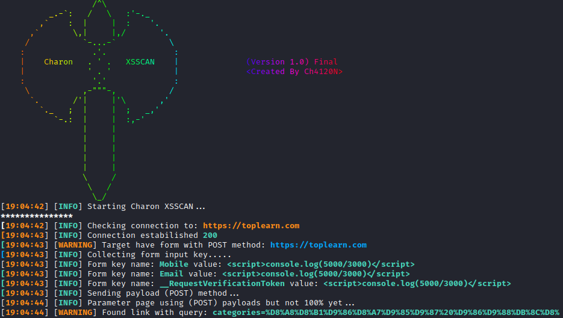

<head>
  <meta name="google-site-verification" content="Mtc7thZm2cASv87NSnHWL82UkeTzblQQK4r74bJX3NU" />
</head>

<!-- ## Charon XSS Scanner
A Powerfull XSS (Cross-Site Scripting) Scanner -->
## Charon XSS Scanner

<!-- <p align="left">
  
  
</p> -->

## Project Programmer
> Ch4120N - Ch4120ni@Gmail.com

## Made For
> Finding XSS Vulnerabilities In WebSites By Crawling.

## 👀 Screenshot


## ⚓ Requires
> Python3
> 
> pip install -r requirements.txt

## ⚙️ Installation

```bash
git clone https://github.com/Ch4120N/Charon-XSS-Scanner
chmod 755 -R Charon-XSS-Scanner
cd Charon-XSS-Scanner
python -m pip install -r requirements.txt
python chxsscan.py
```
## 📑 Options

```
usage: Chxsscan --url <target> [options]

Options:
  -h, --help            Show usage and help parameters
  -u , --url            Target url (e.g. http://testphp.vulnweb.com)
  -d , --depth          Depth web page to crawl. Default: 2
  -pl , --payload-level 
                        Level for payload Generator, 7 for custom payload. {1...6}. Default: 6
  -p , --payload        Load custom payload directly (e.g. <script>alert(2005)</script>)
  -m , --method         Method setting(s): 
                                0: GET
                                1: POST
                                2: GET and POST (default)
  --user-agent          Request user agent (e.g. Chrome/2.1.1/...)
  -s , --single         Single scan. No crawling just one address
  --proxy               Set proxy (e.g. {'https':'https://10.10.1.10:1080'})
  -a, --about           Print information about `Charon XSSCAN` tool
  -c , --cookie         Set cookie (e.g {'ID':'1094200543'})
```
<!-- ## Usage
```bash
python chxsscan.py --url [Target] [OPTIONS]
```

## Example

```bash
python chxsscan.py -d 3 --url http://testphp.vulnweb.com  -pl 6 -m 2
``` -->
## ✨ Features

* Crawling all links on a website ( Crawler Engine )
* POST and GET forms are supported
* Many settings that can be customized
* Advanced error handling
* Very High Speed

## ❤️ Donation 
> bitcoin:   bc1ql4syps7qpa3djqrxwht3g66tldyh4j7qsyjkq0

## 🚨 Reporting Issues

If you are facing a configuration issue or something is not working as you expected to be, please use the **Ch4120ni@Gmail.com**

## ⚠️ Legal disclaimer ⚠️

> Usage of `Charon XSS Scanner` for attacking targets without prior mutual consent is illegal. It's the end user's responsibility to obey all applicable local, state and federal laws. Developers assume no liability and are not responsible for any misuse or damage caused by this program.
